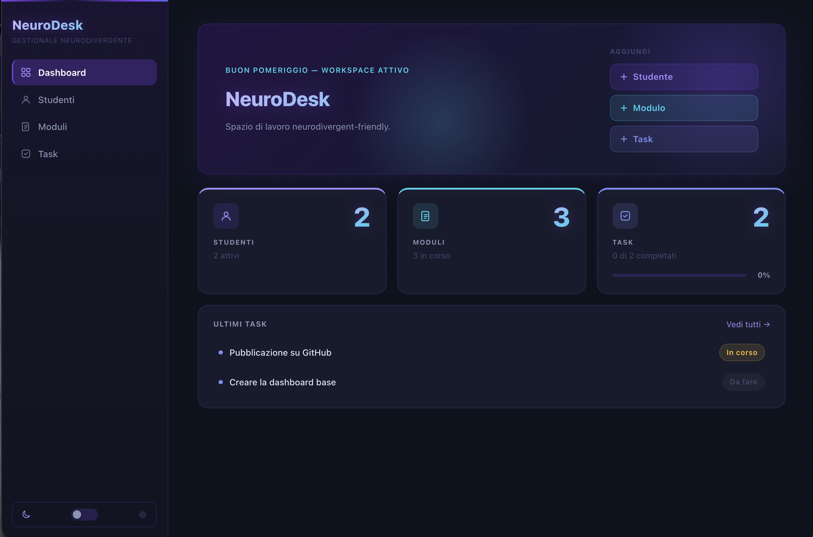
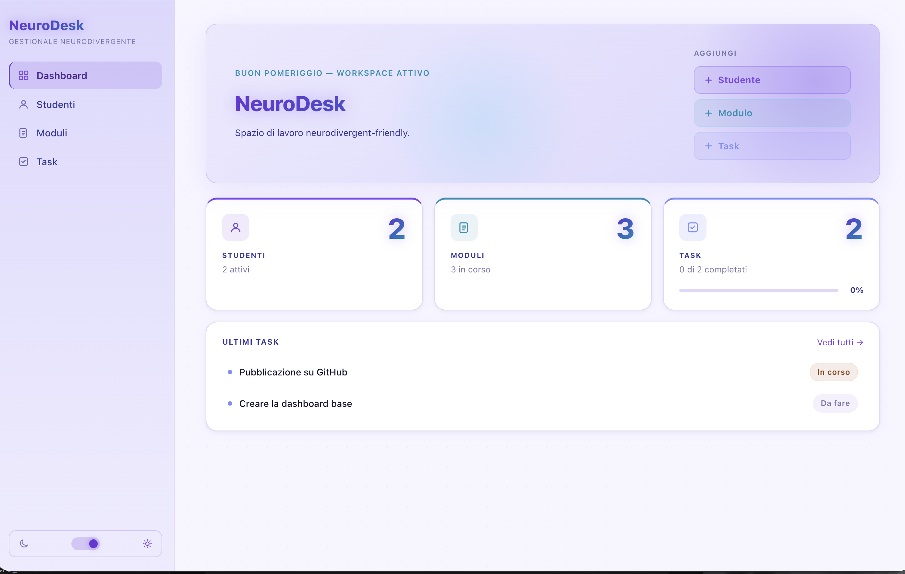
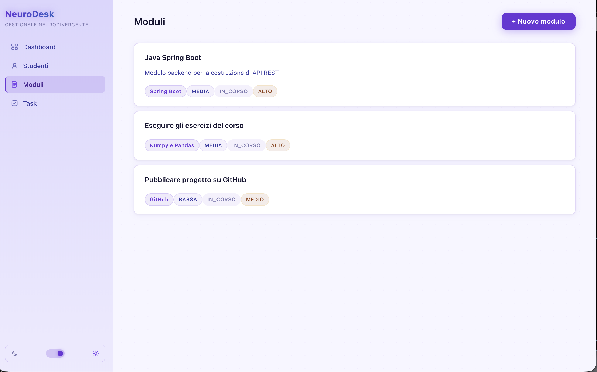
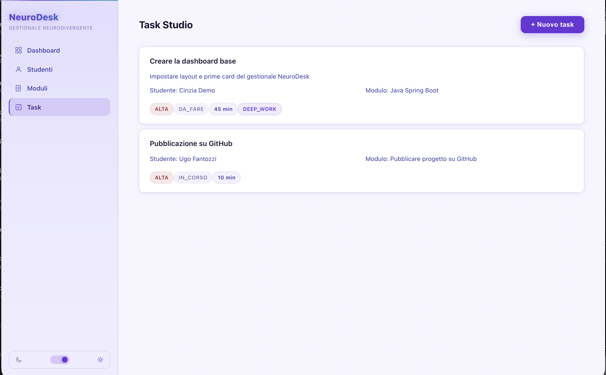

# NeuroDesk

NeuroDesk is a study task manager designed for students with ADHD, autism, high cognitive load, or uneven energy patterns.

It brings students, study modules, and tasks into one structured workspace, so planning does not depend on scattered notes, memory, or pure survival instinct.

---

## What it does

- Manage students and their preferred energy levels
- Organize study modules by technology, difficulty, and cognitive load
- Track tasks with priority, status, focus tags, and energy windows
- Show dashboard counters and task completion progress

---

## Why it is not just another to-do list

Most task apps treat all tasks as interchangeable.

NeuroDesk does not.

Each task is connected to a student and a study module, with fields such as `tagFocus`, `finestraEnergia`, and `caricoCognitivo`.

The goal is to model how studying actually works when attention, energy, and cognitive load are not constant.

---

## Tech stack

### Backend

- Java 21
- Spring Boot
- Spring Data JPA + Hibernate
- MySQL
- Jakarta Validation
- Maven

### Frontend

- React 19 + Vite
- React Router
- Custom CSS design system
- Dark / light mode with localStorage persistence

---

## Running locally

### Prerequisites

- Java 21
- Node.js 18+
- MySQL

### Backend

1. Create a MySQL database named `neurodesk_db`
2. Copy `backend/src/main/resources/application.properties.example` to `application.properties` and fill in your database credentials
3. Run the backend:

```bash
cd backend
./mvnw spring-boot:run
```

### Frontend

```bash
cd frontend
npm install
npm run dev
```

Frontend runs on `http://localhost:5173`  
Backend runs on `http://localhost:8080`

---

## Project status

MVP complete.  
Authentication and student self-registration are not yet implemented.

## Screenshots

### Dashboard (Dark Mode)


### Dashboard (Light Mode)


### Student Management


### Module Management


### Task Studio


---

## Author

Built by Cinzia Cipri as a final project for a full-stack developer course.
