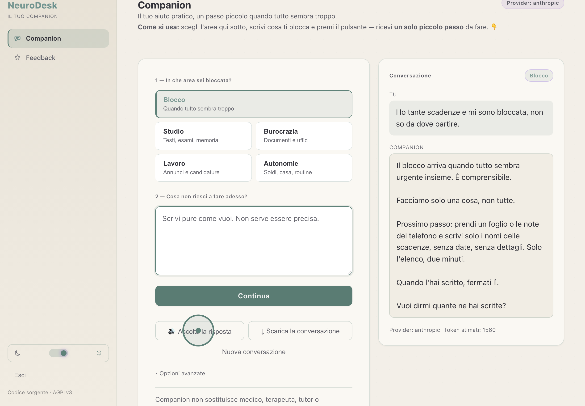

# NeuroDesk

NeuroDesk e' una piattaforma full stack nata come progetto finale per un corso Full Stack Developer e poi evoluta in un sistema di supporto per persone neurodivergenti, con particolare attenzione ad ADHD, carico cognitivo alto, difficolta' di memoria, difficolta' di sintesi, studio non lineare, energia variabile e blocchi pratici.

Il progetto e' stato pensato e curato da Cinzia Cipri.

**Online:** [neurodesk.it](https://neurodesk.it) (sito pubblico, IT/EN/FR) ·
[app.neurodesk.it](https://app.neurodesk.it) (applicazione, si entra con un codice) ·
[guida per i tester](https://neurodesk.it/aiuto.html)



## Nota sullo stato dell'AI (importante)

Il Companion funziona **da subito in modalita' demo (`mock`)**: risponde in locale,
in modo deterministico, senza chiavi e senza consumare token. Questa modalita' e'
pensata per mostrare l'architettura completa, i flussi e l'interfaccia senza costi.

Le **risposte AI reali** (generate da un modello linguistico) richiedono una chiave API.
Il servizio parla con **Anthropic** (provider usato in produzione) oppure con un endpoint
**OpenAI compatibile**: si sceglie con `AI_PROVIDER`. Basta inserire la chiave nel file
`companion-service/.env` e avviare il
servizio con il flag che carica le variabili d'ambiente:

```bash
node --env-file=companion-service/.env companion-service/src/server.js
```

Senza chiave, il servizio resta volutamente in `mock` (verificabile con
`GET /health` -> `"provider": "mock"`). Questa e' una scelta progettuale: il
gancio AI e' l'ultimo passo di configurazione, non una parte mancante del codice.

## Da cosa e' nato

La prima versione di NeuroDesk nasceva come gestionale didattico: una piattaforma per organizzare studenti, moduli di studio e task. L'idea iniziale era mostrare competenze full stack attraverso un'applicazione concreta, non una semplice lista di cose da fare.

Fin dall'inizio il progetto aveva una direzione precisa: trattare lo studio come un processo influenzato da energia, attenzione, difficolta', carico cognitivo e priorita'. Per questo le entita' non sono generiche:

- uno studente ha un profilo neurodivergente e un livello di energia preferito
- un modulo ha difficolta', tecnologia, stato e carico cognitivo
- un task ha priorita', stato, durata stimata, tag focus e finestra di energia

Questa struttura permette di rappresentare uno studio piu' realistico: non tutti i task pesano allo stesso modo, non tutte le persone funzionano nello stesso modo, e non tutte le giornate hanno la stessa energia.

## A cosa e' arrivato

Il progetto oggi e' composto da quattro parti:

1. Backend Spring Boot
2. Frontend React + Vite
3. Companion Service Node.js per funzioni AI
4. Sito pubblico statico (`landing/`), in italiano, inglese e francese

La prima parte resta un gestionale di studio. La seconda parte rende il gestionale navigabile da interfaccia web. La terza parte aggiunge un servizio AI separato, pensato per trasformare blocchi, confusione e sovraccarico in micro-azioni sostenibili.

Il Companion e' integrato nel frontend come pagina React, protetto da login e da
consenso esplicito, con le conversazioni salvate cifrate sul server. Il sistema e'
in prova con un piccolo gruppo di tester su un server pubblico.

## Perche' e' stato esteso con AI

Dopo la prima versione, il progetto e' stato riletto alla luce di un caso reale: una persona adulta con ADHD, difficolta' cognitive, problemi fisici, terapie, difficolta' con studio, lavoro, burocrazia, soldi, memoria e autostima.

Da questa analisi e' emerso che un semplice task manager non basta.

Una persona in forte sovraccarico spesso non ha bisogno di una dashboard piu' ricca. Ha bisogno di una domanda piu' piccola:

> Cosa non riesci a fare adesso?

NeuroDesk Companion nasce per questo: non per sostituire professionisti, tutor, medici o servizi sociali, ma per aiutare a ridurre il caos a un prossimo passo concreto.

## Cosa fa oggi

### Gestionale principale

- emissione e revoca dei **codici di accesso anonimi** (pagina *Codici*)
- dashboard con i codici emessi, quanti attivi e quanti hanno dato il consenso
- gestione moduli e task di studio (strumenti di test, nascosti in produzione)
- tema chiaro/scuro, interfaccia responsive
- campi specifici per energia, focus e carico cognitivo

### Accesso e consenso

- si entra con un **codice**, non con nome ed email: l'account e' anonimo
- del codice il database conserva solo un hash con pepper, mai il valore in chiaro
- schermata di **consenso informato** obbligatoria per gli utenti, revocabile in
  qualsiasi momento dalle opzioni del Companion
- il consenso viaggia firmato dentro il JWT ed e' verificato anche dal Companion,
  che ricontrolla lo stato reale sul backend (revoca efficace entro ~60s)
- conversazioni **cifrate** (AES-256-GCM) e cancellate automaticamente dopo 30 giorni
- l'utente puo' scaricare la conversazione e cancellare la propria cronologia

### Companion Service

- endpoint `GET /health`
- endpoint `POST /api/companion/respond`
- modalita' operative:
  - `crisis_mode`
  - `study_mode`
  - `bureaucracy_mode`
  - `work_mode`
  - `autonomy_mode`
- modalita' `mock` senza consumo token
- provider `anthropic` (usato in produzione) e `openai` compatibile
- endpoint protetto da JWT e da rate limiting per IP
- prompt di sistema dedicato al target neurodivergente/adulto fragile
- filtro safety base prima della chiamata AI
- stima token in modalita' mock
- documentazione API in `docs/api-contract.md`

## Stack tecnico

### Backend

- Java 21
- Spring Boot 4
- Spring Web MVC
- Spring Data JPA
- Hibernate
- MySQL
- Jakarta Validation
- Maven

Cartella:

```text
backend
```

API principali:

```text
POST   /api/auth/login              accesso con codice (o codice + password per l'admin)
GET    /api/auth/me                 ruolo e stato del consenso
POST   /api/auth/consenso           da' il consenso (rilascia un token nuovo)
DELETE /api/auth/consenso           revoca il consenso

GET    /api/tester                  codici emessi (solo admin)
POST   /api/tester                  emette un codice (in chiaro una volta sola)
PUT    /api/tester/{id}/stato       revoca o riattiva

GET    /api/companion-sessions      le proprie conversazioni (cifrate a riposo)
POST   /api/companion-sessions/scambio
DELETE /api/companion-sessions      diritto all'oblio

GET    /api/moduli · POST /api/moduli · GET /api/task · POST /api/task
```

### Frontend

- React 19
- Vite
- React Router
- CSS custom con variabili tema
- dark/light mode con `localStorage`
- proxy Vite per il Companion Service
- error boundary: un errore non lascia mai una pagina bianca

Cartella:

```text
frontend
```

### Companion Service

- Node.js >= 20.6
- moduli nativi Node
- nessuna dipendenza esterna
- `node --env-file=.env`
- provider mock
- provider Anthropic (usato in produzione)
- provider OpenAI compatibile
- verifica JWT scritta a mano con il solo modulo `crypto` (algoritmo pinnato a HS256)

Cartella:

```text
companion-service
```

## Accessibilita' e design

L'interfaccia e' stata rivista per ridurre alcuni stimoli visivi non adatti al target:

- i blob animati della dashboard sono statici
- il pattern a puntini e' stato reso piu' leggero
- i glow sul testo sono stati rimossi
- e' stata aggiunta la media query `prefers-reduced-motion`
- il tema chiaro/scuro resta disponibile

Questa scelta nasce dal fatto che movimento periferico, rumore visivo e testo sfocato possono aumentare il carico percettivo per persone con ADHD, difficolta' di lettura o sovraccarico cognitivo.

## Privacy, token e limiti

Il Companion Service puo' funzionare in due modi:

- `AI_PROVIDER=mock`: nessun dato viene inviato a provider AI esterni
- `AI_PROVIDER=openai`: il messaggio e il profilo fornito possono essere inviati al provider configurato

In modalita' AI reale, l'utente finale deve collegare una propria API key o sottoscrivere un piano che copra il costo dei token.

Prima di inviare dati sensibili, l'interfaccia dovra' informare chiaramente l'utente. Dati come diagnosi, invalidita', terapie, salute, difficolta' cognitive, burocrazia e situazione economica sono dati delicati.

NeuroDesk Companion non:

- fa diagnosi
- interpreta QI, invalidita' o referti
- consiglia farmaci
- sostituisce medico, psicologo, tutor, CAF, patronato, universita' o consulente legale
- promette lavoro, benefici, guarigione o risultati universitari

In caso di rischio immediato per la sicurezza personale, il servizio invita a contattare il 112 o una persona fidata.

## Gestione degli accessi

**Non esiste registrazione pubblica.** Gli accessi li rilascia soltanto chi
gestisce il servizio, dalla pagina *Codici*, ed e' una scelta deliberata: il
Companion tratta dati di categoria particolare (neurodivergenza, salute,
difficolta' cognitive — Art. 9 GDPR), quindi la raccolta deve avvenire dentro un
perimetro di consenso, non tramite auto-iscrizione libera.

Un accesso **e'** un codice (`neuro-xxxx-xxxx-xxxx-xxxx`, ~80 bit di entropia):
niente nome, niente email. Il codice in chiaro esiste solo nell'istante in cui
viene emesso — nel database ne resta un hash SHA-256 con pepper — quindi non e'
recuperabile e va consegnato subito. Un'etichetta facoltativa («Clelia»,
«tester 3») serve solo a chi amministra per ricordarsi a chi l'ha dato: non
viaggia col codice e non entra nelle conversazioni.

La revoca e' immediata sul backend, che ricontrolla `attivo` a ogni richiesta, e
arriva al Companion entro ~60s tramite l'endpoint interno servizio-a-servizio.

In produzione `neurodesk.test-mode` **deve restare `false`**: gli endpoint
`/api/test/**` rispondono allora `404`, come se non esistessero.

## Stato attuale

In prova con un piccolo gruppo di tester, su server pubblico con HTTPS, provider
AI reale (Anthropic), backup notturni e controllo periodico dei servizi.

Verifiche eseguite il 27 luglio 2026:

- frontend `npm run lint` e `npm run build`: passati
- pagina *Codici*: provata end-to-end (il codice emesso fa login, dopo la revoca
  il login risponde 401, la riattivazione lo rimette in funzione)
- Companion: provato con Playwright da desktop e da telefono, in sviluppo e sulla
  build di produzione con la CSP reale
- landing: controllo automatico su tutte e 21 le pagine (link, ancore, selettore
  di lingua, errori JS)
- `POST /api/companion/respond` senza token: risponde `401`, nessun consumo di token AI

## Documentazione

- HOWTO operativo: `docs/HOWTO_USO.md`
- MVP Companion: `docs/neurodesk-companion-mvp.md`
- Prompt di sistema: `docs/system-prompt.md`
- Contratto API: `docs/api-contract.md`
- Piano di integrazione: `docs/integration-plan.md`
- Esempi di flussi: `docs/example-flows.md`
- Checklist di messa in produzione: `docs/DEPLOY_CHECKLIST.md`
- Prove di sicurezza svolte: `docs/security-tests.md`
- Guida pubblica per i tester: `landing/aiuto.html` (IT), `.en` e `.fr`

## Struttura progetto

```text
neurodesk
├── backend             Spring Boot: accessi, codici, conversazioni cifrate, feedback
├── frontend            React + Vite: gestionale e Companion
├── companion-service   Node: il ponte verso il provider AI, senza dipendenze esterne
├── landing             sito pubblico statico, IT/EN/FR (compresa la guida ai tester)
├── deploy              preparazione del server, pubblicazione, controllo periodico
├── docs
└── README.md
```

Pubblicazione: `bash deploy/02-pubblica.sh root@IP` compila in locale, carica gli
artefatti e riavvia i servizi. I segreti restano sul server e non passano mai da qui.

## Due cose da sapere prima di metterci mano

### Cambiare lo schema del database

Lo schema **non** lo decide piu' Hibernate. Vive in `backend/src/main/resources/db/migration`
come file numerati, e Hibernate all'avvio si limita a verificare che le entita' Java
corrispondano: se non corrispondono, l'applicazione **rifiuta di partire** invece di
modificare il database di nascosto.

Per aggiungere un campo o una tabella:

1. Scrivi il file `V2__descrizione_breve.sql` in `db/migration` (il numero cresce, il
   nome dopo il doppio underscore e' libero).
2. Cambia l'entita' Java di conseguenza.
3. Prova in locale: se il file SQL e l'entita' non concordano, il backend non parte.
   E' il controllo che serve.
4. Pubblica. Flyway applica la migrazione all'avvio, una volta sola.

`V1` e' la fotografia dello schema di produzione al 28 luglio 2026 e sui database che
esistono gia' non viene eseguita, solo registrata. Non modificarla mai: una migrazione
gia' applicata e' immutabile, le correzioni si fanno con un file nuovo.

### Rigenerare gli screenshot del sito

Le immagini del prodotto sulle pagine pubbliche le produce uno script, non una cattura
a mano — cosi' non invecchiano in silenzio quando l'interfaccia cambia.

```bash
# servono backend, companion e vite accesi, e un database DEDICATO con etichette finte
cd frontend
USCITA=/tmp/shot node screenshot.mjs <codice1> <codice2> <codice3> <codice4-mai-usato>
```

Due vincoli: mai puntarlo alla produzione (in un'immagine pubblica non deve poter finire
il nome di una persona vera), e il Companion va acceso con il provider AI **vero** — una
risposta generata dal mock mostrerebbe una cosa che l'app non fa.

## Prossimi passi tecnici

Fatti nel frattempo: storico delle conversazioni, salvataggio cifrato lato Spring
Boot, tabelle `CompanionSession`/`CompanionMessaggio`, rate limiting, consenso
esplicito e revocabile, provider Anthropic, deploy con HTTPS.

Restano:

1. Migrazioni di schema esplicite (Flyway) al posto di `ddl-auto=update`, prima del
   primo cambio di schema con dati reali dentro.
2. Aggiungere una tabella `MicroAction` per tracciare i passi proposti e completati.
3. Tradurre l'applicazione: oggi e' solo in italiano, mentre il sito e la guida
   sono anche in inglese e francese.
4. Tradurre gli screenshot delle pagine pubbliche nelle altre lingue man mano
   che l'interfaccia viene tradotta (oggi le catture mostrano l'interfaccia
   italiana con conversazioni nelle tre lingue).

## Autrice

Progetto ideato, sviluppato e curato da Cinzia Cipri come progetto finale full stack, poi ampliato come piattaforma neurodivergent-friendly con estensione AI.

## Licenza

Copyright (C) 2026 Cinzia Cipri.

NeuroDesk e' software libero: puoi ridistribuirlo e/o modificarlo secondo i
termini della **GNU Affero General Public License, versione 3** (AGPLv3) come
pubblicata dalla Free Software Foundation. Il testo completo e' nel file
[`LICENSE`](LICENSE).

La scelta dell'AGPLv3 e' deliberata: chiunque usi, modifichi o offra NeuroDesk
**come servizio in rete** e' tenuto a rendere disponibile il codice sorgente
completo, con la stessa licenza. NeuroDesk puo' essere usato anche in contesti
commerciali, ma **non puo' essere reso proprietario o chiuso**: deve restare un
bene comune a disposizione delle persone neurodivergenti a cui e' rivolto.

Il copyright resta in capo all'autrice. Chi desidera termini diversi da quelli
dell'AGPLv3 (ad es. una licenza commerciale) puo' contattare l'autrice per un
accordo separato.
